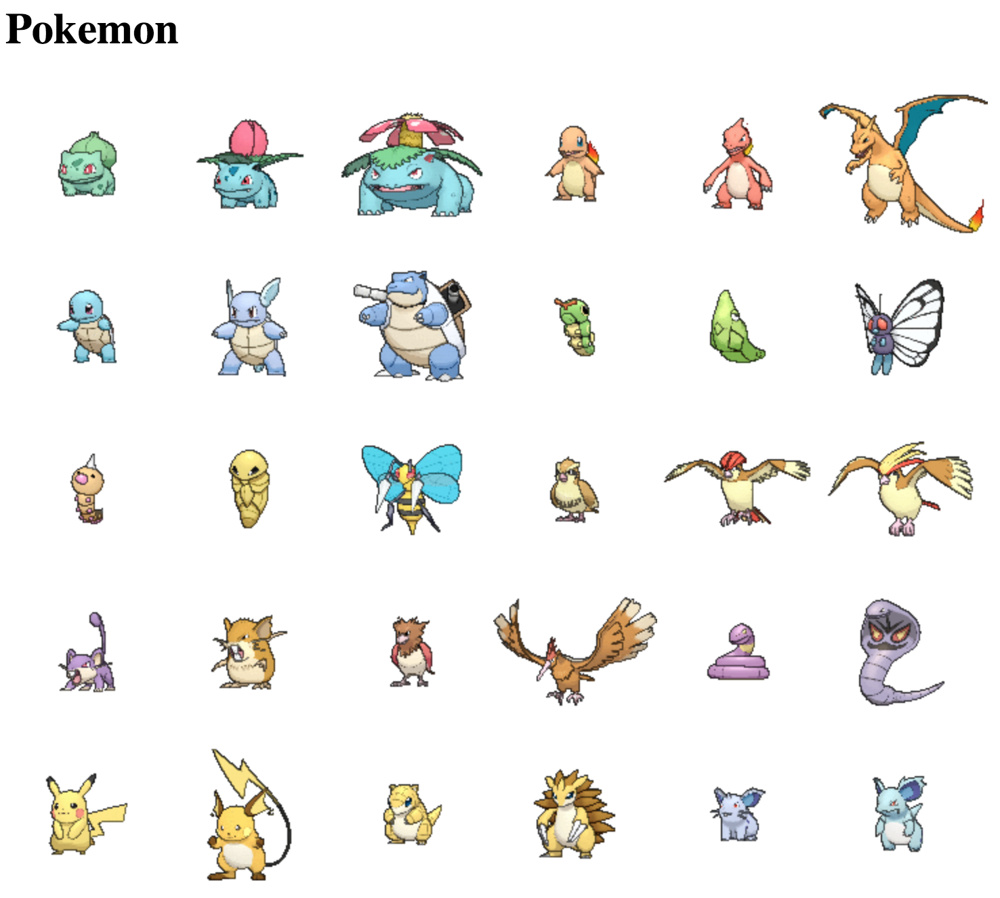
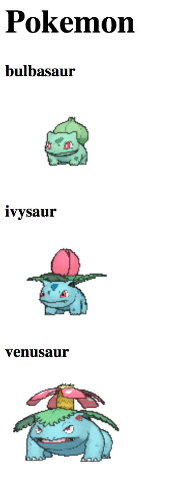

# Pokemon Lab
Files Needed
- `pokemon.csv`
- `pokemon.html`
- `pokemon.py`

## Part I: Using Python to Generate a Webpage
```html
<html>
  <body>
    <div>NY Times</div>
    
  </body>
</html>
```
The sample HTML code above is really just a long string. Write a python function that receives two strings: a title and an image link and produces an html page with the title placed in between `div` tags and the image link inserted after the `src` attribute within an `img` tag.
1. Create a `.py` file to start.
2. Write to an `.html` file. Use `open()`.
3. Make a helper function `makeDivTag(material)` that receives a string that gets placed in between the opening and closing `div` tags as a string.
4. Make a helper function `makeImgTag(link)` that receives a string that gets placed inside the `src` attribute.
5. Write a function `makeWebpage(content)` that makes the `html` and `body` tags and calls the two helper functions you created to put together the html page you see above. You will need a variable that starts off as an empty string that you keep adding to create the content that goes in between the `body` tags.

## Part II: Generating a Webpage from a CSV File
#### Pokemon Image Maker
```html

```
1. Substitute 3 other names from the `.csv` file to where `POKEMON_NAME` is.
2. Navigate to the link in your web browser to see if the image link actually works.
3. Make a `makePokemonImgTag(pokemonName)` that uses your `makeImgTag()` function. But now, you have to manipulate the `link` to be able to accept different names.
```python
makPokemonImgTag("bulbasaur") # returns "https://img.pokemondb.net/sprites/x-y/normal/bulbasaur.png"
makPokemonImgTag("charmander") # returns "https://img.pokemondb.net/sprites/x-y/normal/charmander.png"
```

#### Reading from a CSV File
1. Make a function `makePokemonWebPage()` that opens the `pokemon.csv` file.
2. Use the `makeWebPage()` inside.
3. Read through the lines of the `pokemon.csv` using the appropriate method.
3. Loop through the lines extracting the name of the Pokemon.
4. Pass the name of the Pokemon to your `makePokemonImgTag()` function.
5. Insert all the `img` tags you're making in the loop to the content that you pass to the `makeWebPage()`. If it works, your webpage should look something like:

6. Add a `div` tag containing each pokemon's name next to their image using `makeDivTag()` function.


#### Challenge
How would you go about adding some styling to the webpage? Try to change the color of the background and the color of the text according to the pokemon's type.  
