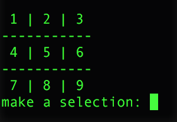
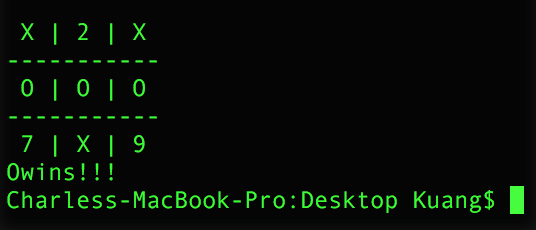

# Variable Scope
Similar to NetLogo, you can declare global variables. However you have to declare that you are using a global variable within a function. Otherwise, python will assume that you are using a local variable.

```python
global counter
counter = 17
def addOne():
  counter = 1
  print counter
```

```python
global counter
counter = 17
def addOne():
  global counter
  print counter
```

## Exercise
Go [here](tictactoe_scaffold.py) for a tic-tac-toe scaffold.


